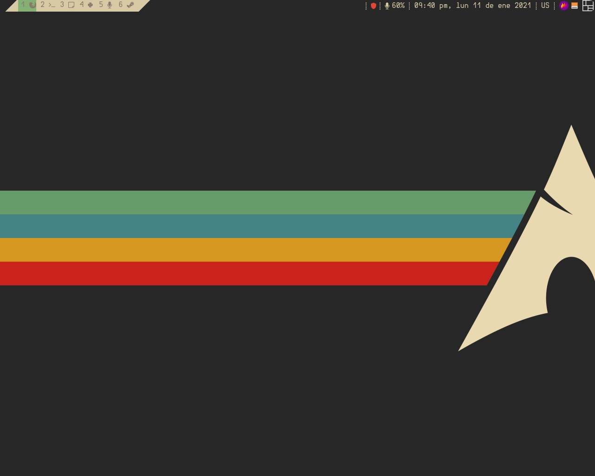
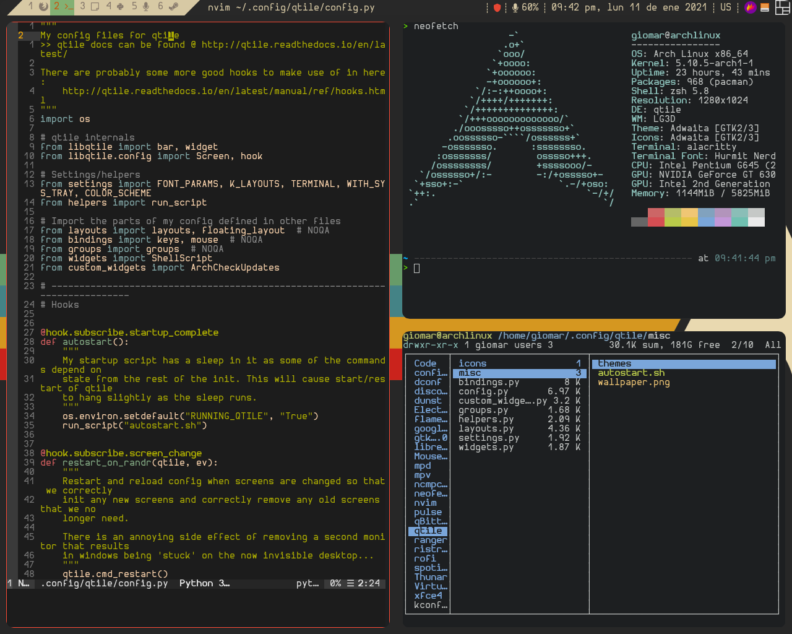

# Configuración Arch / Qtile





**_Idioma_**

- 🇪🇸 Español
- [🇺🇸 English](https://github.com/GiomarOsorio/dotfiles)

# Índice

- [Introducción](#introducción)
- [Instalación de Arch Linux](#instalación-de-arch-linux)
  - [Antes de usar](#antes-de-usar)
  - [Como usar el script](#como-usar-el-script)
- [Instalación de configuración personal](#instalación-de-arch-linux)
  - [Como usar el script](#como-usar-el-script-1)
  - [Instalación manual](#instalación-manual)
    - [Dependencias](#dependencias)
  - [Archivos y configuración](#archivos-y-configuración)
    - [Copiando archivos](#copiando-archivos)
    - [Configurando temas](#configurando-temas)
  - [Monitores](#monitores)
- [Configuración básica de Qtile](#configuración-básica-de-qtile)
  - [Atajos de teclado](#atajos-de-teclado)
    - [Apps](#apps)
    - [Audio](#audio)
    - [Captura de pantalla](#captura-de-pantalla)
    - [Ventanas](#ventana)

# Introducción

Este repositorio contiene mi configuración personal, así como dos scripts que escribí que me ayudan a realizar una instalación limpia de Arch Linux, debo aclarar que dicho script está basado en los scripts [_archfi_](https://github.com/MatMoul/archfi) y [_archdi-pkg_](https://github.com/MatMoul/archdi-pkg), desarrolados por el usuario [_MatMoul_](https://github.com/MatMoul), si eres nuevo en Arch Linux o deseas un script de instalación más púlido te invito a probar el script [_archfi_](https://github.com/MatMoul/archfi).

# Instalación de Arch Linux

## Antes de usar

Antes de usar el script es necesario modificar algunas variables, lo primero es descargar el script (asegurate de tener internet).

```bash
curl -O https://raw.githubusercontent.com/giomarosorio/master/install_arch
```

Abrimos con el editor de texto de terminal de confianza y nos vamos a la función "loadconfigs" **línea 1184**, a partir de ahi iremos cambiandos las siguientes variables por los de su preferencia.

### keymap

```
keymap="us"
```

### editor

```
editor="vim"
```

### locale

```
locale="es_VE"
```

### set time

```
timezone="America/Caracas"
```

## Como usar el script

Una vez estes en el ambiente de instalación de Arch.

```bash
sh install_arch
```

Si bien este repositorio contiene las configuraciónes de todos los programas que utilizo, los scripts estan diseñados para por defecto instalar los paquetes necesarios para el bien funcionamiento de la configuracion personal, sin tomar aquellos paquetes de preferencia personal, si quieres la configuracion completa puedes ejecutar el script de la siguiente manera:

```bash
sh install_arch --workflow
```

# Instalación de configuración personal

## Como usar el script

Tambien puedes usar el script a partir de una instalación limpia basada en Arch Linux

```bash
curl -O https://raw.githubusercontent.com/giomarosorio/master/install_app && sh install_app
```

Al igual que el primer script puedes instalar la configuración

```bash
curl -O https://raw.githubusercontent.com/giomarosorio/master/install_app && sh install_app --workflow
```

## Instalación Manual

### Dependencias

- Generales

  - Paquetes

    ```bash
    alacritty base base-devel curl dmenu dunst feh firefox flameshot font-bh-ttf gifsicle git gsfonts gvfs gvfs-nfs gvfs-mtp gvfs-smb lib32-mesa lightdm-webkit2-greeter mesa pacman-contrib pamixer qtile ranger redshift sdl_ttf sudo tig ttf-bitstream-vera ttf-dejavu ttf-liberation ueberzug udiskie wget xorg-server xorg-fonts-type1 zsh zsh-autosuggestions zsh-completions zsh-lovers
    ```

- XFCE

  - Paquetes

    ```bash
    lightdm lightdm-gtk-greeter lightdm-gtk-greeter-settings xfce4 xfce4-goodies xdg-user-dirs xdg-user-dirs-gtk
    ```

  - Servicios

    ```bash
    lightdm
    ```

- Audio

  - Paquetes

    ```bash
    pulseaudio pulseaudio-alsa pavucontrol alsa-utils alsa-plugins alsa-lib alsa-firmware gstreamer gst-plugins-good gst-plugins-bad gst-plugins-base gst-plugins-ugly volumeicon playerct
    ```

- Impresora

  - Paquetes

    ```bash
    cups cups-pdf ghostscript gsfonts gutenprint gtk3-print-backends libcups system-config-printer
    ```

  - Servicios

    ```bash
    cups
    ```

- Consola

  - Paquetes

    ```bash
    pacman-contrib base-devel bash-completion usbutils dmidecode dialog gpm
    ```

- Herramientas de compresión

  - Paquetes

    ```bash
    zip unzip unrar p7zip lzop
    ```

- Servicios

  - Paquetes

    ```bash
    networkmanager openssh cronie haveged intel-ucode
    ```

  - Servicios

    ```bash
    NetworkManager, sshd, cronie, haveged
    ```

- Sistema de archivos

  - Paquetes

    ```bash
    dosfstools ntfs-3g btrfs-progs exfat-utils gptfdisk autofs fuse2 fuse3 fuseiso
    ```

- Paquetes AUR

  - Paquetes

    ```bash
    lightdm-webkit2-theme-glorious picom-ibhagwan-git ttf-ms-fonts
    ```

- Workflow

  - Paquetes Generales

    ```bash
    ctags hplip hunspell hunspell-es_ve hyphen hyphen-es kolourpaint languagetool libreoffice-fresh mpc mpd mpv mythes-es ncmpcpp neovim nodejs npm python-neovim python-pip qbittorrent xcb-util-cursor
    ```

  - Paquetes AUR

    ```bash
    aic94xx-firmware bashmount discord_arch_electron google-chrome jdownloader2 libpdfium-nojs megasync minecraft-launcher nvidia-390xx-dkms nvidia-390xx-settings nvidia-390xx-utils opencl-nvidia-390xx runelite-launcher telegram-desktop-bin ventoy-bin visual-studio-code-bin wd719x-firmware zoom
    ```

  - Paquetes PIP

    ```bash
    virtualenv pynvim python-language-server flake8 pylint black jedi
    ```

  - Paquetes NPM

    ```bash
    neovim eslint eslint-config-airbnb-base
    ```

## Archivos y configuración

Primero que nada asegurate de tener las [dependencias](#dependencias) instaladas.

### Copiando archivos

```bash
git clone https://github.com/GiomarOsorio/dotfiles.git
cd dotfiles
cp -r .config ~
cp -r .local ~
cp .eslintrc.json ~
cp .zshrc ~
```

### Configurando temas

```bash
sed -i "/^#greeter-session=example-gtk-gnome/ cgreeter-session=lightdm-webkit2-greeter" /etc/lightdm/lightdm.conf
sed -i "/^webkit_theme        = antergos/ cwebkit_theme        = glorious" /etc/lightdm/lightdm-webkit2-greeter.conf
sed -i "/^debug_mode          = false/ cdebug_mode          = true" /etc/lightdm/lightdm-webkit2-greeter.conf
```

## Monitores

Este configuración esta preparada para correr en un solo monitor, pero puedes modificarla para que corra en 2 o más, parte de esta configuración esta basada en la del usuario [_Sminez_](https://github.com/sminez/qtile-config).

# Configuración básica de Qtile

## Atajos de teclado

Descripción de los atajos básicos segun mi configuración en Qtile

### Apps

| Atajo                   | Acción          |
| ----------------------- | --------------- |
| **mod + enter**         | abrir alacritty |
| **mod + shift + enter** | abrir dmenu     |
| **mod + r**             | abrir ranger    |
| **mod + e**             | abrir thunar    |
| **mod + b**             | abrir chrome    |
| **mod + m**             | abrir ncmpcpp   |

### Audio

| Atajo         | Acción        |
| ------------- | ------------- |
| **mod + F11** | subir volumen |
| **mod + F12** | subir volumen |

### Captura de Pantalla

| Atajo            | Acción          |
| ---------------- | --------------- |
| **Print Screen** | abrir flameshot |

### Ventanas

| Atajo                    | Acción                                                                |
| ------------------------ | --------------------------------------------------------------------- |
| **mod + [⬅⬇⬆➡]**         | navegación entre ventanas (⬅=izquierda, ⬇=abajo, ⬆=arriba, ➡=derecha) |
| **mod + shift + [⬅⬇⬆➡]** | mover ventana (⬇=izquierda,⬇=abajo, ⬆=arriba, ➡=derecha)              |
| **mod + [hjkl]**         | navegación entre ventanas (h=izquierda, j=abajo, k=arriba, l=derecha) |
| **mod + shift + [hjkl]** | mover ventana (h=izquierda, j=abajo, k=arriba, l=derecha)             |
| **mod + shift + [1-6]**  | mover ventana al espacio de trabajo N (1-6)                           |
| **mod + f**              | maximizar ventana                                                     |
| **mod + [1-6]**          | cambiar al espacio de trabajo N (1-6)                                 |
| **mod + tab**            | cambiar a siguiente layout                                            |
| **mod + shift + tab**    | cambiar a anterior layout                                             |
| **mod + w**              | cerrar ventana                                                        |
| **mod + ctrl + l**       | bloquear sesión                                                       |
| **mod + espacio**        | cambiar distribución de teclado                                       |
| **mod + control + r**    | reiniciar qtile                                                       |
| **mod + control + l**    | abrir pantalla de bloqueo                                             |
| **mod + control + q**    | cerrar sesión                                                         |
