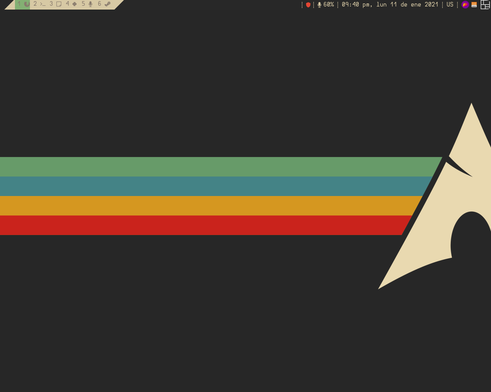
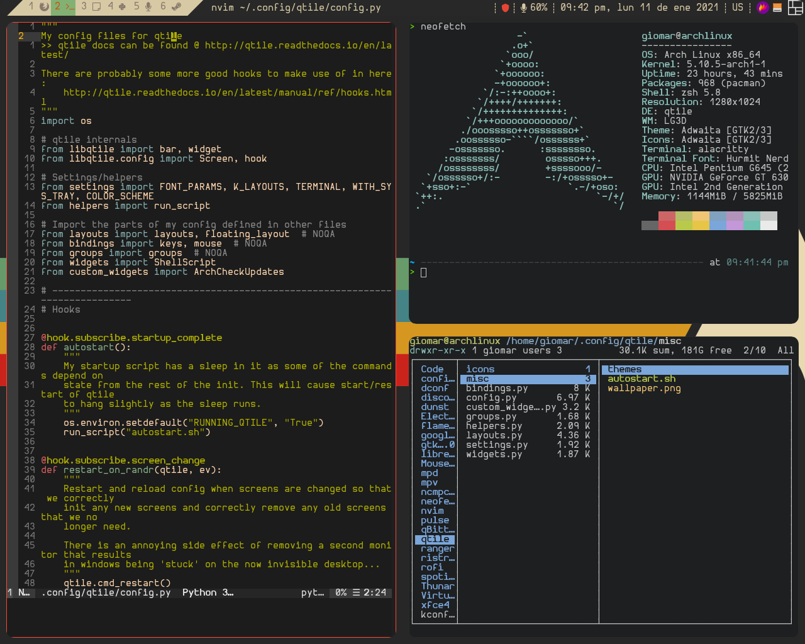
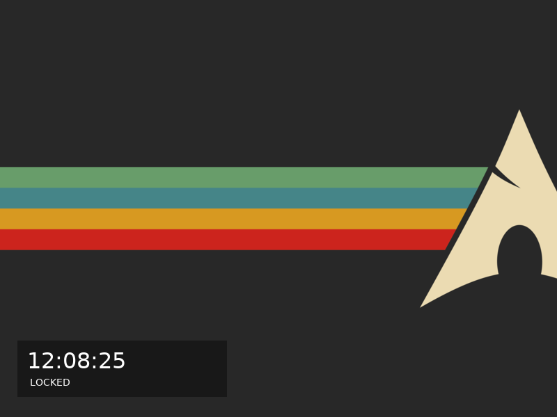

# Configuration Arch / Qtile





**_Language_**

- [🇪🇸 Español](https://github.com/GiomarOsorio/dotfiles/blob/dev/README.es.md)
- 🇺🇸 English

# Index

- [Introduction](#introduction)
- [Arch Linux Installation](#arch-linux-install)
  - [Before use](#before-use)
  - [How to use the script](#how-to-use-the-script)
- [Personal configuration installation](#linux-arch-install)
  - [How to use the script](#how-to-use-the-script-1)
  - [Manual installation](#manual-installation)
    - [Dependencies](#dependencies)
  - [Files and settings](#files-and-settings)
    - [Copying files](#copying-files)
    - [Configuring themes](#configuring-themes)
  - [Monitors](#monitors)
- [Qtile basic configuration](#qtile-basic-configuration)
  - [Keyboard shortcuts](#keyboard-shortcuts)
    - [Apps](#apps)
    - [Audio](#audio)
    - [Screenshot](#screenshot-screenshot)
    - [Windows](#window)

# Introduction

This repository contains my personal configuration, as well as two scripts that I wrote that help me to perform a clean installation of Arch Linux, I must clarify that this script is based on the [_archfi_](https://github.com/MatMoul/archfi) and [_archdi-pkg_](https://github.com/MatMoul/archdi-pkg) scripts, developed by user [_MatMoul_] (https://github.com/MatMoul), if you are new to Arch Linux or want a more polished installation script I invite you to try the [_archfi_](https://github.com/MatMoul/archfi) script.

# Install Arch Linux

## Before using

Before using the script it is necessary to modify some variables, the first thing is to download the script (make sure you have internet).

```bash
curl -O https://raw.githubusercontent.com/dotfiles/giomarosorio/master/install_arch
```

Open with the trusted terminal text editor and go to the "loadconfigs" function **line 1184**, from there we will change the following variables for those of your preference.

### keymap

```
keymap = "us"
```

### editor

```
editor = "vim"
```

### locale

```
locale = "es_VE"
```

### set time

```
timezone = "America / Caracas"
```

## How to use the script

Once you are in the Arch installation environment.

```bash
sh install_arch
```

Although this repository contains the configuration of all the programs that I use, the scripts are designed by default to install the necessary packages for the proper functioning of the personal configuration, without taking those packages of personal preference, if you want the complete configuration you can execute the script as follows:

```bash
sh install_arch --workflow
```

# Installation of personal settings

## How to use the script

You can also use the script from a clean install based on Arch Linux

```bash
curl -O https://raw.githubusercontent.com/giomarosorio/master/install_app && sh install_app
```

Like the first script you can install the configuration

```bash
curl -O https://raw.githubusercontent.com/giomarosorio/master/install_app && sh install_app --workflow
```

## Manual Installation

### Dependencies

- General

  - Packages

    ```bash
    alacritty base base-devel curl dmenu dunst feh firefox flameshot font-bh-ttf gifsicle git gsfonts gvfs gvfs-nfs gvfs-mtp gvfs-smb lib32-mesa lightdm-webkit2-greeter mesa pacman-contrib pamixer qtile ranger redshift sdl_ttf sudo tig ttf-bitstream-vera ttf-dejavu ttf-liberation ueberzug udiskie wget xorg-server xorg-fonts-type1 zsh zsh-autosuggestions zsh-completions zsh-lovers
    ```

- XFCE

  - Packages

    ```bash
    lightdm lightdm-gtk-greeter lightdm-gtk-greeter-settings xfce4 xfce4-goodies xdg-user-dirs xdg-user-dirs-gtk
    ```

  - Services

    ```bash
    lightdm
    ```

- Audio

  - Packages

    ```bash
    pulseaudio pulseaudio-alsa pavucontrol alsa-utils alsa-plugins alsa-lib alsa-firmware gstreamer gst-plugins-good gst-plugins-bad gst-plugins-base gst-plugins-ugly volumeicon playerct
    ```

- Printer

  - Packages

    ```bash
    cups cups-pdf ghostscript gsfonts gutenprint gtk3-print-backends libcups system-config-printer
    ```

  - Services

    ```bash
    cups
    ```

- Console

  - Packages

    ```bash
    pacman-contrib base-devel bash-completion usbutils dmidecode dialog gpm
    ```

- Compression tools

  - Packages

    ```bash
    zip unzip unrar p7zip lzop
    ```

- Services

  - Packages

    ```bash
    networkmanager openssh cronie haveged intel-ucode
    ```

  - Services

    ```bash
    NetworkManager, sshd, cronie, haveged
    ```

- File System

  - Packages

    ```bash
    dosfstools ntfs-3g btrfs-progs exfat-utils gptfdisk autofs fuse2 fuse3 fuseiso
    ```

- AUR Packages

  - Packages

    ```bash
    lightdm-webkit2-theme-glorious picom-ibhagwan-git ttf-ms-fonts
    ```

- Workflow

  - General Packages

    ```bash
    ctags hplip hunspell hunspell-es_ve hyphen hyphen-es kolourpaint languagetool libreoffice-fresh mpc mpd mpv mythes-es ncmpcpp neovim nodejs npm python-neovim python-pip qbittorrent xcb-util-cursor
    ```

  - AUR Packages

    ```bash
    aic94xx-firmware bashmount discord_arch_electron google-chrome jdownloader2 libpdfium-nojs megasync minecraft-launcher nvidia-390xx-dkms nvidia-390xx-settings nvidia-390xx-utils opencl-nvidia-390xx runelite-launcher telegram-desktop-bin ventoy-bin visual-studio-code-bin wd719x-firmware zoom
    ```

  - PIP Packages

    ```bash
    virtualenv pynvim python-language-server flake8 pylint black jedi
    ```

  - NPM Packages

    ```bash
    neovim eslint eslint-config-airbnb-base
    ```

## Files and settings

First of all make sure you have the [dependencies](#dependencies) installed.

### Copying files

```bash
git clone https://github.com/GiomarOsorio/dotfiles.git
cd dotfiles
cp -r .config ~
cp -r .local ~
cp .eslintrc.json ~
cp .zshrc ~
```

### Setting themes

```bash
sed -i "/^#greeter-session=example-gtk-gnome/ cgreeter-session=lightdm-webkit2-greeter" /etc/lightdm/lightdm.conf
sed -i "/^webkit_theme        = antergos/ cwebkit_theme        = glorious" /etc/lightdm/lightdm-webkit2-greeter.conf
sed -i "/^debug_mode          = false/ cdebug_mode          = true" /etc/lightdm/lightdm-webkit2-greeter.conf
```

## Monitors

This configuration is prepared to run on a single monitor, but you can modify it to run on 2 or more, part of this configuration is based on that of the user [_Sminez_](https://github.com/sminez/qtile-config).

# Basic Qtile configuration

## Keyboard shortcuts

Description of the basic shortcuts according to my configuration in Qtile

### Apps

| Shortcut                | Action         |
| ----------------------- | -------------- |
| **mod + enter**         | open alacritty |
| **mod + shift + enter** | open dmenu     |
| **mod + r**             | open ranger    |
| **mod + e**             | open thunar    |
| **mod + b**             | open chrome    |
| **mod + m**             | open ncmpcpp   |

### Audio

| Shortcut      | Action         |
| ------------- | -------------- |
| **mod + F11** | turn up volume |
| **mod + F12** | turn up volume |

### Screenshot

| Shortcut         | Action         |
| ---------------- | -------------- |
| **Print Screen** | open flameshot |

### Windows

| Shortcut                 | Action                                                     |
| ------------------------ | ---------------------------------------------------------- |
| **mod + [⬅⬇⬆➡]**         | navigation between windows (⬅=left, ⬇=down, ⬆=up, ➡=right) |
| **mod + shift + [⬅⬇⬆➡]** | move window (⬅=left, ⬇=down, ⬆=up, ➡=right)                |
| **mod + [hjkl]**         | navigation between windows (h=left, j=down, k=up, l=right) |
| **mod + shift + [hjkl]** | move window (h=left, j=down, k=up, l=right)                |
| **mod + shift + [1-6]**  | move window to workspace N (1-6)                           |
| **mod + f**              | maximize window                                            |
| **mod + [1-6]**          | switch to workspace N (1-6)                                |
| **mod + tab**            | change to next layout                                      |
| **mod + shift + tab**    | change to previous layout                                  |
| **mod + w**              | close window                                               |
| **mod + ctrl + l**       | lock session                                               |
| **mod + space**          | change keyboard layout                                     |
| **mod + control + r**    | restart qtile                                              |
| **mod + control + l**    | lockscreen                                                 |
| **mod + control + q**    | log out                                                    |
